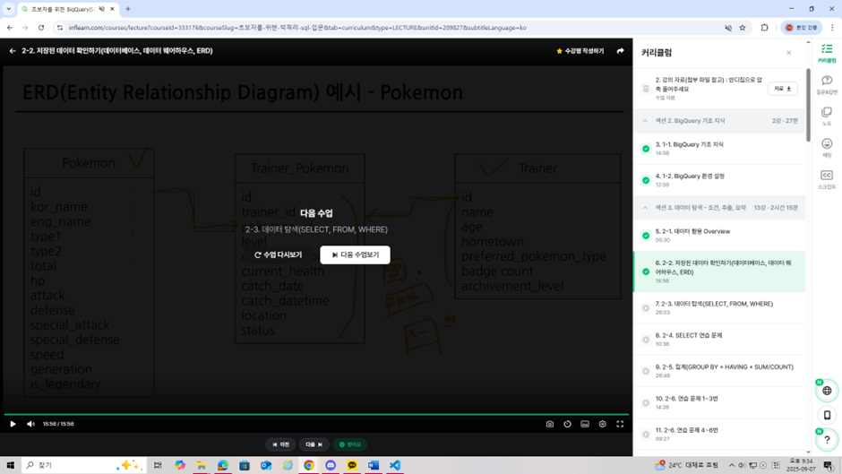

# SQL_BASIC 1주차 정규 과제 

📌SQL_BASIC 정규과제는 매주 정해진 분량의 `초보자를 위한 BigQuery(SQL) 입문` 강의를 듣고 간단한 문제를 풀면서 학습하는 것입니다. 이번주는 아래의 **SQL_Basic_1st_TIL**에 나열된 분량을 수강하고 `학습 목표`에 맞게 공부하시면 됩니다.

**1주차 과제**에서는 수강한 내용을 모두 요약 정리하기보다는, **SQL이 왜 필요한지에 대해 배우고 느낀 점, 그리고 강의를 듣고 본인이 원하는 목표를 중심으로 작성**하여 과제 업로드 시트에 깃허브 링크를 스프레드시트 'SQL' 시트에 붙여서 넣어주세요. 

**👀(수행 인증샷은 필수입니다.)** 

## SQL_BASIC_1st_TIL

### 섹션 2. BigQuery 기초 지식

### 1-1. BigQuery 기초 지식

### 1-2. BigQuery 환경 설정

## 섹션 3. 데이터 탐색 - 조건, 추출, 요약

### 2-1. 데이터 활용 Overview 

### 2-2. 저장된 데이터 확인하기

## 🏁 강의 수강 (Study Schedule)

| 주차  | 공부 범위              | 완료 여부 |
| ----- | ---------------------- | --------- |
| 1주차 | 섹션 **1-1** ~ **2-2** | ✅         |
| 2주차 | 섹션 **2-3** ~ **2-5** | 🍽️         |
| 3주차 | 섹션 **2-6** ~ **3-3** | 🍽️         |
| 4주차 | 섹션 **3-4** ~ **4-4** | 🍽️         |
| 5주차 | 섹션 **4-4** ~ **4-9** | 🍽️         |
| 6주차 | 섹션 **5-1** ~ **5-7** | 🍽️         |
| 7주차 | 섹션 **6-1** ~ **6-6** | 🍽️         |

 

<!-- 여기까진 그대로 둬 주세요-->

---

# 1️⃣ 개념정리 
<!-- 강의 수강 이후에 아래의 학습 목표에 맞게 개념을 자유롭게 정리해주세요.-->
## 1-1. BigQuery 기본지식

~~~
✅ 학습 목표 :
* 데이터 관련 기초 지식(OLTP, SQL, Row, Column, 저장 형태 등)을 설명할 수 있다. 
* BigQuery 관련 기초 지식에 대해서 파악할 수 있다. 
~~~

Database : 데이터 저장소 / Table : 데이터가 저장된 공간

OLTP(Online Transaction Processing) : 거래를 하기 위해 사용되는 데이터베이스, 보류/중간 상태가 없음 -> 데이터가 무결함, 데이터의 추가(Insert) or 데이터의 변경(Update)이 많이 발생함, SQL을 사용해 데이터 추출 가능, but 분석을 위해 만든 데이터베이스가 아니기에 쿼리 속도가 느릴 수 있음

SQL(Structured Query Language) : 데이터베이스에서 데이터를 가지고 올 때 사용하는 언어, 데이터베이스의 데이터를 관리하기 위해 설계된 특수 목적의 프로그래밍 언어

Row : 새로운 row는 가로로 한 줄을 의미

Column : 세로로 연상, 각 데이터의 특정 속성 값을 의미

테이블에 저장 형태 = 엑셀, 스프레드시트와 유사함

OLAP(Online Analytical Processing) : 분석을 위한 기능 제공되는 서비스

데이터 웨어하우스 : 데이터를 한 곳에 모아서 저장하는 창고

BigQuery : Google cloud의 OLAP + Data warehouse
    -> 쉽게 데이터 추출 가능, 속도 빠름, Firebase/Google Analytics 4의 데이터를 쉽게 추출 가능, 별도의 서버(컴퓨터) 필요 X

## 2-1. 데이터 활용 Overview

~~~
✅ 학습 목표 :
* 데이터를 활용하는 과정을 설명할 수 있다.
* 데이터를 탐색하는 과정으로 조건과 추출, 요약을 할 수 있다. 
~~~

어떠한 일을 해야함(Task) -> 원하는 것을 정해야 함(문제를 정의 해야 함) -> 필요한 데이터를 탐색(단일 자료/다량의 자료) -> 데이터에 대한 조건(필터링), 추출, 변환, 요약 -> 데이터 결과 검증(예상과 실제 동일한가) -> 피드백 / 활용
데이터 탐색부터 데이터 결과 검증까지 SQL이 활용됨

## 2-2. 저장된 데이터 활용하기

~~~
✅ 학습 목표 :
* 데이터가 저장되는 형태를 알고 저장된 데이터를 활용할 수 있다. 
~~~

<!-- 새롭게 배운 내용을 자유롭게 정리해주세요.-->

---
# 2️⃣ 학습 인증란

 
 

---

# 3️⃣ 확인문제

## 문제 1

> **🧚Q. 포켓몬 게임이나 이커머스 산업과 같이 다양한 산업에서는 각기 다른 데이터가 존재합니다. 다음 중 하나의 산업을 선택하고, 해당 산업에서 수집하고 활용될 수 있는 데이터 항목 (칼럼) 5가지를 자유롭게 상상하여 나열해보세요.**
>
> - 예시 산업 
>
> >  온라인 음식 배달 / 스마트 헬스 케어 / 중고 거래 앱 / 교육 플랫폼 등 

<!--현실과 데이터 분석의 연결 고리를 상상하고, 데이터를 저장하는 형태를 활용하는 문제입니다. -->

<!--학습한 개념을 활용하여 자유롭게 설명해 보세요. 구체적인 예시를 들어 설명하면 더욱 좋습니다.-->

~~~
여기에 답을 작성해주세요!
~~~

## 문제 2

> **🧚Q. 이번 강의를 통해 SQL이 왜 필요하다고 느끼는지, SQL을 통해 본인이 어떤 것을 해내고 싶은지를 자유롭게 작성해보세요.**

~~~
여기에 답을 작성해주세요.
~~~

### 🎉 수고하셨습니다.

