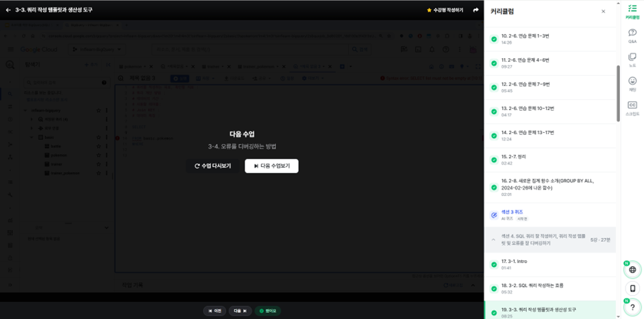

# SQL_BASIC 3주차 정규 과제 

📌SQL_BASIC 정규과제는 매주 정해진 분량의 `초보자를 위한 BigQuery(SQL) 입문` 강의를 듣고 간단한 문제를 풀면서 학습하는 것입니다. 이번주는 아래의 **SQL_Basic_3rd_TIL**에 나열된 분량을 수강하고 `학습 목표`에 맞게 공부하시면 됩니다.

**3주차 과제는 문제 풀이를 중심으로**, 강의에서 제시된 예제 문제 중 **7 문제 이상을 선택하여 직접 풀어본 뒤**, 강의 영상의 풀이와 비교해 **틀린 부분, 맞은 부분, 새롭게 배운 개념**을 구체적으로 정리해주세요. (적어도 3문제는 정리해야 합니다.) 완성된 과제는 Gihub에 업로드하고, 링크를 스프레드시트 'SQL' 시트에 입력해 제출해주세요.

**(수행 인증샷은 필수입니다.)** 

## SQL_BASIC_3rd

### 섹션 3. 데이터 탐색 - 조건, 추출, 요약

### 2-6. 연습문제 1~3번

### 2-6. 연습문제 7~9번

### 2-6. 연습문제 10~12번

### 2-6. 연습문제 13~17번

### 2-7. 정리 

### 2-8. 새로운 집계함수

## 섹션 4. 쿼리 잘 작성하기, 쿼리 작성 템플릿 및 오류를 잘 디버깅하기

### 3-1. INTRO

### 3-2. SQL 쿼리 작성하는 흐름

### 3-3. 쿼리 작성 템플릿과 생산성 도구 

## 🏁 강의 수강 (Study Schedule)

| 주차  | 공부 범위              | 완료 여부 |
| ----- | ---------------------- | --------- |
| 1주차 | 섹션 **1-1** ~ **2-2** | ✅         |
| 2주차 | 섹션 **2-3** ~ **2-5** | ✅         |
| 3주차 | 섹션 **2-6** ~ **3-3** | ✅         |
| 4주차 | 섹션 **3-4** ~ **4-4** | 🍽️         |
| 5주차 | 섹션 **4-4** ~ **4-9** | 🍽️         |
| 6주차 | 섹션 **5-1** ~ **5-7** | 🍽️         |
| 7주차 | 섹션 **6-1** ~ **6-6** | 🍽️         |

 

<!-- 여기까진 그대로 둬 주세요-->

---

# 1️⃣ 개념정리

## 2-6. 연습문제

~~~
✅ 학습 목표 :
* 연습문제(7문제 이상) 푼 것들 정리하기
~~~

-- 1. 포켓몬 중에 type 2가 없는 포켓몬의 수를 작성하는 쿼리를 작성해주세요

-- (힌트) ~가 없다 : 컬럼 IS NULL

-- 조건 : type 2가 없는
  
  -- type2가 어떻게 생겼지? type2의 정의는 무엇이지?

-- null은 뭘까?
  
  -- 아무것도 없는 값. 값이 존재하지 않을 때 null
  
  -- type2 : null
  
  -- null 0이랑 다르고, "" 과도 다름 ==> 값이 없는 상태
  
  -- 연산자 IS NULL
  
  -- type2 IS NULL
  
  -- type2 = null은 안되냐? ==> X. NULL은 다른 값과 직접 비교할 수 없음. NULL = NULL 거짓이 아니라 알 수 없음
  
  -- 핵심 : NULL은 IS 연산자를 사용한다!
  
  -- type2 IS NOT NULL => NULL 아닌 애들 

-- 어떤 테이블? : pokemon

-- 어떤 컬럼 : 따로 없음. 포켓몬의 수만 남기면 됨

-- 어떻게 집계 : 포켓몬의 수 => COUNT

SELECT
  
  COUNT(id) AS cnt

FROM basic.pokemon

WHERE
  
  type2 IS NULL
  
  -- WHERE 절에서 여러 조건을 연결하고 싶은 경우 ==> AND
  
  -- OR 조건 => (  ) OR (  )

-- 2. type2가 없는 포켓몬의 type1과 type1의 포켓몬 수를 알려주는 쿼리를 작성해주세요. 단, type1의 포켓몬 수가 큰 순으로 정렬해주세요.

-- 테이블 : pokemon

-- 조건 : type2가 없는 포켓몬

-- 컬럼 : type1

-- 집계 : 포켓몬 수 ==> COUNT

-- 정렬 : type1의 포켓몬 수가 큰 순으로 정렬 => ORDER BY. 큰 순으로 : 큰 것부터 작은 것으로 => 내림차순(DESC) => ORDER BY 포켓몬 수 DESC

SELECT
  
  type1,
  
  -- 빨간 밑줄 : 에러 메세지
  
  COUNT(id) AS pokemon_cnt
  
  -- 집계 함수는 GROUP BY 와 같이 다님. 집계하는 기준(컬럼)이 없으면 COUNT만 쓸 수 있으나, 집계하는 기준이 있다면 그 기준 컬럼을 GROUP BY에 써줘야 한다

FROM basic.pokemon

WHERE
  
  type2 IS NULL

GROUP BY
  
  type1

ORDER BY
  
  pokemon_cnt DESC

-- 3. type2 상관없이 type1의 포켓몬 수를 알 수 있는 쿼리를 작성해주세요

-- 테이블 : pokemon

-- 조건 : type2 상관없이 => 조건인가? 아닌가? => 조건이 아님

-- 컬럼 : type1

-- 집계 : 포켓몬 수 => COUNT

SELECT
  
  type1,
  
  COUNT(id) AS pokemon_cnt,
  
  COUNT(DISTINCT id) AS pokemon_cnt2
  
  -- DISTINCT 언제 쓸까? => 고유한 값만 보고 싶을 때 사용한다. Unique한 값만 알고 싶은 경우 사용
  
  -- COUNT(id) = COUNT(DISTINCT id)
  
  -- id를 설계할 때, 중복이 없게 설계했음. 그래서 두개의 결과가 동일
  
  -- 어떤 컬럼은 중복이 있게 설계되곤 함
  
  -- DISTINCT도 걸어서 보시고, 어떤 값이 더 맞을까?
  
  -- DISTINCT : DAU(Daily Active User)
  
  -- Active한 유저의 수를 하루 단위로 집계
  
  -- COUNT(DISTINCT user_id) AS dau => 이런 데이터를 저장하는 곳에 접속 기록, 이벤트 로그가 여러 Row가 존재 => Unique => DISTINCT

FROM basic.pokemon

GROUP BY
  
  type1

-- 4. 전설 여부에 따른 포켓몬 수를 알 수 있는 쿼리를 작성해주세요.

-- 테이블 : pokemon

-- 조건 : 없음

-- 컬럼 : 전설(is_legendary)

-- 집계 : 포켓몬 수

SELECT
  
  is_legendary,
  
  -- 컬럼의 이름 앞부분 일부를 입력하고 기다리면 자동 완성을 할 수 있는데, 이 때 찾아서 엔터
  
  COUNT(id) AS pokemon_cnt

FROM basic.pokemon

GROUP BY
  
  is_legendary
  
  -- 1

-- ORDER BY DESC

-- GROUP BY : is_legendary가 같다. GROUP BY에 컬럼이 많이 있을 수 있음(5개 + COUNT)

-- GROUP BY 1 => SELECT의 첫 컬럼을 의미

-- ORDER BY에도 1,2 등을 사용할 수 있음

-- 1, 2 => 쿼리를 빠르게 작성하고, 결과를 보는 과정. 완성된 쿼리문에서는 1, 2 같은 표현보단 명확하게 컬럼을 명시하는 게 좋습니다.(가독성 관점)

-- 5. 동명이인이 있는 이름은 무엇일까요? (한번에 찾으려고 하지 않고 단계적으로 가도 괜찮아요)

-- 테이블 : trainer

-- 조건 : 같은 이름이 2개 이상(동명이인) => COUNT(name) => 2개 이상

-- 컬럼 : 이름

-- 집계 : COUNT

SELECT
  
  name,
  
  COUNT(name) AS trainer_cnt

FROM basic.trainer

GROUP BY
  
  name

-- 집계 후 조건 => HAVING, FROM 절의 테이블 조건 => WHERE

HAVING
  
  trainer_cnt >= 2

-- WHERE : 원본 데이터 FROM 절에 있는 데이터에 조건을 설정하고 싶은 경우

-- HAVING : GROUP BY와 함께 집계 결과에 조건을 설정하고 싶은 경우

-- 서브쿼리 : 쿼리문을 한번 감싸서 다른 쿼리문에서 사용할 수 있음

SELECT
  *

FROM (
  
  SELECT
    
    name,
    
    COUNT(name) AS trainer_cnt
  
  FROM basic.trainer
  
  GROUP BY
  
    name
)

WHERE
  trainer_cnt >= 2

-- HAVING을 쓰면 쿼리 줄 수가 줄어든다.

-- 6. trainer 테이블에서 "Iris" 트레이너의 정보를 알 수 있는 쿼리를 작성해주세요.

-- 테이블 : trainer

-- 조건 : 트레이너의 이름 = "Iris"

-- 컬럼 : 정보 => 모든 컬럼

-- 집계 : X

SELECT
  *

FROM basic.trainer

WHERE
  name = "Iris"

-- 7. trainer 테이블에서 "Iris", "Whitney", "Cynthia" 트레이너의 정보를 알 수 있는 쿼리를 작성해주세요

-- (힌트) 컬럼 IN ("Iris", "Whitney", "Cynthia")

-- 테이블 : trainer

-- 조건 : 이름 = "Iris", "Whitney", "Cynthia" 중에 있으면 추출

-- 컬럼 : 정보 -> *

-- 집계 : 없음

SELECT
  *

FROM basic.trainer

WHERE
  -- (name = "Iris")
  
  -- OR (name = "Whitney")
  
  -- OR (name = "CynthIa")
  
  -- OR 조건으로 쓰는 거 너무 길다. 귀찮다 => IN => name에 괄호 안의 Value가 있는 Row만 추출

  name IN ("Iris", "Whitney", "Cynthia")

## 2-8. 새로운 집계함수

~~~
✅ 학습 목표 :
* SQL 쿼리 구조를 이해할 수 있다. 
* SELECT, FROM, WHERE을 활용하는 방법을 설명할 수 있다. 
~~~

GROUP BY ALL : SELECT에 있는 비집계 컬럼을 GROUP BY에 자동으로 포함시켜 주는 문법, 일일이 반복 명시 필요 X

## 3-2. 쿼리를 작성하는 흐름

~~~
✅ 학습 목표 :
* 쿼리를 작성하는 흐름을 설명할 수 있다.
~~~

1. 지표 고민
- 어떤 문제를 해결하기 위해 데이터가 필요한 지

2. 지표 구체화
- 추상적이지 않고 구체적인 지표 명시 (분자, 분모 표시)

3. 지표 탐색
- 유사한 문제를 해결한 케이스가 있나 확인 -> 있다면 해당 쿼리 리뷰

4. 쿼리 작성
- 유사한 케이스가 없다면 데이터가 있는 테이블 찾기
- 테이블이 2개 이상이라면 JOIN 고민

5. 데이터 정합성 확인
- 예상한 결과와 동일한 지 확인

6. 쿼리 가독성 확보
- 나중을 위해 깔끔하게 쿼리 작성

7. 쿼리 저장
- 쿼리는 재사용되므로 문서로 저장

실무에서 쿼리는 쿼리 작성도 중요하지만 앞부분과 뒷부분이 매우 중요함

## 3-3. 쿼리 작성 템플릿과 생산성 도구

~~~
✅ 학습 목표 :
* 생산성 도구를 만들 수 있다.
~~~

쿼리 작성 템플릿
-	쿼리를 작성하는 목표, 확인할 지표
-	쿼리 계산 방법
-	데이터의 기간
-	사용할 테이블
-	Join Key
-	데이터 특징

SELECT

FROM

WHERE

ESPANSO는 명령 프롬프트에서 계속 오류가 나 실패하였습니다. 해결하는 대로 업로드 하도록 하겠습니다.

 
 

---

# 2️⃣ 학습 인증란

  

---

# 3️⃣ 확인문제

## 문제 1

> **🧚Q. 포켓몬 게임에 재미를 느낀 동혁은 포켓몬 도감에서 강력한 포켓몬 타입을 미리 선점하기 위해, 먼저 어떤 포켓몬들이 있는지 포켓몬 수를 기준으로 내림차순 정렬하여  확인하고자 했습니다.**
>
> 그래서 다음과 같은 필요한 정보를 미리 정리해보았습니다. 

~~~
조건 : type2는 상관없이
보고 싶은 컬럼 : type1
집계 내용 : 각 type1 별 포켓몬 수
정렬 기준 : 포켓몬 수를 기준으로 내림차순 정렬
~~~

> **이 목표를 바탕으로 동혁이 아래와 같은 쿼리를 잘 작성했지만, 일부 SQL 문법 요소를 빼먹었습니다. 비어 있는 부분인 ㄱ,ㄴ,ㄷ 에 들어갈 알맞은 SQL 구문을 채워보세요:**

~~~sql
SELECT type1, (ㄱ)
FROM pokemon
(ㄴ) type1
ORDER BY (ㄱ) (ㄷ);
~~~

~~~
(ㄱ) - COUNT(*)
(ㄴ) - GROUP BY
(ㄷ) - DESC
~~~

### 🎉 수고하셨습니다.