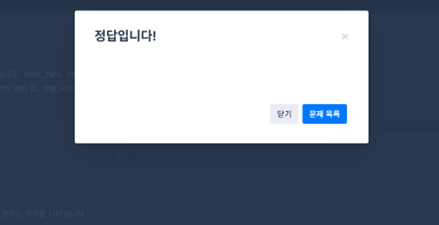

# SQL_BASIC 4주차 정규 과제 

📌SQL_BASIC 정규과제는 매주 정해진 분량의 `초보자를 위한 BigQuery(SQL) 입문` 강의를 듣고 간단한 문제를 풀면서 학습하는 것입니다. 이번주는 아래의 **SQL_Basic_4th_TIL**에 나열된 분량을 수강하고 `학습 목표`에 맞게 공부하시면 됩니다.

**4주차 과제부터는 강의 내용을 정리하는 것과 함께, 프로그래머스에서 제공하는 SQL 문제를 직접 풀어보는 실습도 병행합니다.** 강의에서는 **배운 내용을 정리하고 주요 쿼리 예제를 정리**하며, 프로그래머스 문제는 **직접 풀어본 뒤 풀이 과정과 결과, 배운 점을 함께 기록**해주세요. 완성된 과제는 Github에 업로드하고, 링크를 스프레드시트 'SQL' 시트에 입력해 제출해주세요.

**(수행 인증샷은 필수입니다.)** 

## SQL_BASIC_4th

### 섹션 4. 쿼리 잘 작성하기, 쿼리 작성 템플릿 및 오류를 잘 디버깅하기

### 3-4. 오류를 잘 디버깅하는 방법

## 섹션 5. 데이터 탐색 - 변환

### 4-1. INTRO

### 4-2. 데이터 타입과 데이터 변환(CAST, SAFE_CAST)

### 4-3. 문자열 함수(CONCAT, SPLIT, REPLACE, TRIM, UPPER)

### 4-4. 날짜 및 시간 데이터 이해하기(1) (타임존, UTC, Millisecond, TIMESTAMP/DATETIME)

## 🏁 강의 수강 (Study Schedule)

| 주차  | 공부 범위              | 완료 여부 |
| ----- | ---------------------- | --------- |
| 1주차 | 섹션 **1-1** ~ **2-2** | ✅         |
| 2주차 | 섹션 **2-3** ~ **2-5** | ✅         |
| 3주차 | 섹션 **2-6** ~ **3-3** | ✅         |
| 4주차 | 섹션 **3-4** ~ **4-4** | ✅         |
| 5주차 | 섹션 **4-4** ~ **4-9** | 🍽️         |
| 6주차 | 섹션 **5-1** ~ **5-7** | 🍽️         |
| 7주차 | 섹션 **6-1** ~ **6-6** | 🍽️         |

 

<!-- 여기까진 그대로 둬 주세요-->

---

# 1️⃣ 개념정리

## 3-4. 오류를 디버깅하는 방법

~~~
✅ 학습 목표 :
* 오류의 정의에 대해 설명할 수 있다. 
* 오류 메시지를 보고 디버깅이라는 과정을 수행할 수 있다. 
~~~

오류
- ‘방황하다, 길을 잃다’ 라는 뜻의 라틴어(Errare)에서 유래한 단어
- 부정확하거나 잘못된 행동을 의미
- 실수와 동의어인 경우도 있음

오류가 알려주고자 하는 것
- 현재 작성한 방식으로 하면 답을 얻을 수 없음 (길잡이 역할)
- 이 부분이 문제가 됨 (문제 진단)

대표적인 오류 카테고리 : Syntax Error (문법 오류)
- 문법을 지키지 않아 발생하는 오류

오류 메시지 검색
- 구글
- 공식 문서
- ChatGPT

## 4-2. 데이터 타입과 데이터 변환(CAST, SAFE_CAST)

~~~
✅ 학습 목표 :
* 데이터 타입의 종류를 설명할 수 있다. 
* 데이터 타입을 변환하는 방법을 설명할 수 있다. 
~~~

데이터 타입 – 숫자, 문자, 시간, 날짜, 부울(Bool) …

- 숫자 : 1, 2, 3, 3.14 등
- 문자 : “이렇게 따옴표 안에 있는”
- 시간 : 2025-09-29 18:16:42
- 부울 : 참/거짓

데이터 타입이 중요한 이유
- 보이는 것과 저장된 것의 차이가 존재
- 생각과 다른 경우 데이터의 타입을 변환해야 함

자료 타입을 변경하는 함수 : CAST

더 안전하게 데이터 타입 변경하기 : SAFE_CAST

SAFE_가 붙은 함수는 변환이 실패할 경우 NULL로 변환

~~~
SELECT
 CAST(1 AS STRING) # 숫자 1을 문자 1로 변경
~~~

수학 함수는 수학 연산(평균, 표준편차, 코사인 등)이 존재

## 4-3. 문자열 함수(CONCAT, SPLIT, REPLACE, TRIM, UPPER)

~~~
✅ 학습 목표 :
* 문자열 함수들의 종류를 이해하고 어떠한 상황에서 사용하는지 설명할 수 있다. 
~~~

문자열(STRING) : “안녕하세요”, “DArt-B” -> 이렇게 따옴표가 있는 것들

문자열 함수

- 문자열 붙이기
    - CONCAT : 문법 -> CONCAT(칼럼1, 칼럼 2, …)

- 문자열 분리하기
	- SPLIT : 문법 : SPLIT(문자열 원본, 나눌 기준이 되는 문자)
	- 배열(ARRAY) 타입으로 결과가 나옴

- 특정 단어 수정하기
	- REPLACE : 문법 -> REPLACE(문자열 원본, 찾을 단어, 바꿀 단어)

- 문자열 자르기
	- TRIM : 문법 -> TRIM(문자열 원본, 자를 단어)

- 영어 대문자 변환
	- UPPER : 문법 -> UPPER(문자열 원본)

## 4-4. 날짜 및 시간 데이터 이해하기(1) (타임존, UTC, Millisecond, TIMESTAMP/DATETIME)

~~~
✅ 학습 목표 :
* 날짜 및 시간 데이터 타입과 UTC의 개념을 설명할 수 있다. 
* DATE, DATETIME, TIMESTAMP 에 대해서 설명할 수 있다.
* 시간함수들의 종류와 시간의 차이를 추출하는 방법을 설명할 수 있다. 
~~~

날짜 및 시간 데이터 타입 파악하기 : DATE, DATETIME, TIMESTAMP

날짜 및 시간 데이터 관련 알면 좋은 내용 : UTC, Millisecond

DATE : DATE만 표시하는 데이터, (2025-09-29)

DATETIME : DATE와 TIME까지 표시하는 데이터, Time Zone 정보 없음, 2025-09-29 18:36:25

TIME : 날짜와 무관하게 시간만 표시하는 데이터, (18:36:25.00)

타임존
GMT : Greenwich Mean Time (한국 시간 : GMT+9)
- 영국의 그리니치 천문대(경도 0도)를 기준으로 지역에 따른 시간의 차이를 조정하기 위해 생긴 시간의 구분선

UTC : Universal Time Coordinated (한국 시간 : UTC+9)
- 국제적인 표준 시간
- 협정 세계시
- 타임존이 존재한다 = 특정 지역의 표준 시간대

TIMESTAMP
- UTC부터 경과한 시간을 나타내는 값
- Time Zone 정보 있음
- 2025-09-29 18:39:00 UTC

Millisecond (ms)
- 시간의 단위, 천 분의 1초(1,000ms = 1초)
- 빠른 반응이 필요한 분야에서 사용(초보다 더 정확하게)
- Millisecond => TIMESTAMP => DATETIME으로 변경

Microsecond (us)
- 1/1,000 ms
- 1/1,000,000 초

 

 

---

# 2️⃣ 확인문제 & 문제 인증

## 프로그래머스 문제 

> 조건에 맞는 회원 수 구하기 (SELECT, COUNT) 
>
> **먼저 문제를 풀고 난 이후에 확인 문제를 확인해주세요**
>
> 문제 링크 
>
> :  https://school.programmers.co.kr/learn/courses/30/lessons/131535#

## 문제 1

> **🧚Q. 프로그래머스 문제를 풀던 서현이는 여러 번의 시행착오 끝에 결국 혼자 해결하기 어려워 오류 메시지를 공유하며 도움을 요청했습니다. 여러분들이 오류 메시지를 확인하고, 해당 SQL 쿼리에서 어떤 부분이 잘못되었는지 오류 메시지를 해석하고 찾아 설명해주세요.**

~~~sql
# 조건에 맞는 회원 수 구하기 (SELECT, COUNT) 
# 서현이의 SQL 첫 번째 풀이
SELECT COUNT(AGE, JOINED)
FROM USER_INFO
WHERE AGE BETWEEN 20 AND 29
  AND JOINED BETWEEN '2021-01-01' AND '2021-12-31';
  
오류 메시지 : Error: Number of arguments does not match for aggregate function COUNT
 
# 수정하고 난 이후 두 번째 풀이
SELECT AGE, COUNT(*)
FROM USER_INFO
WHERE AGE BETWEEN 20 AND 29
  AND JOINED BETWEEN '2021-01-01' AND '2021-12-31';
  
오류 메시지 : SELECT list expression references column AGE which is neither grouped nor aggregated
~~~

~~~
첫번쨰 풀이 오류
- COUNT() 함수는 하나의 인자만 받을 수 있기에 오류가 발생하기에 COUNT(AGE, JOINED)처럼 두 개의 컬럼을 넣으면 문법의 오류가 발생함.
- 이를 해결하기 위해서는 COUNT(*) 를 사용하면 될 것이라 생각됨.

두번째 풀이 오류
- COUNT(*) 같은 집계 함수와 함께 다른 컬럼(AGE)을 SELECT하려면, 그 칼럼은 GROUP BY 절에 포함되어야 하지만 쿼리에는 GROUP BY가 없기 때문에 오류가 발생함.
~~~

### 🎉 수고하셨습니다.